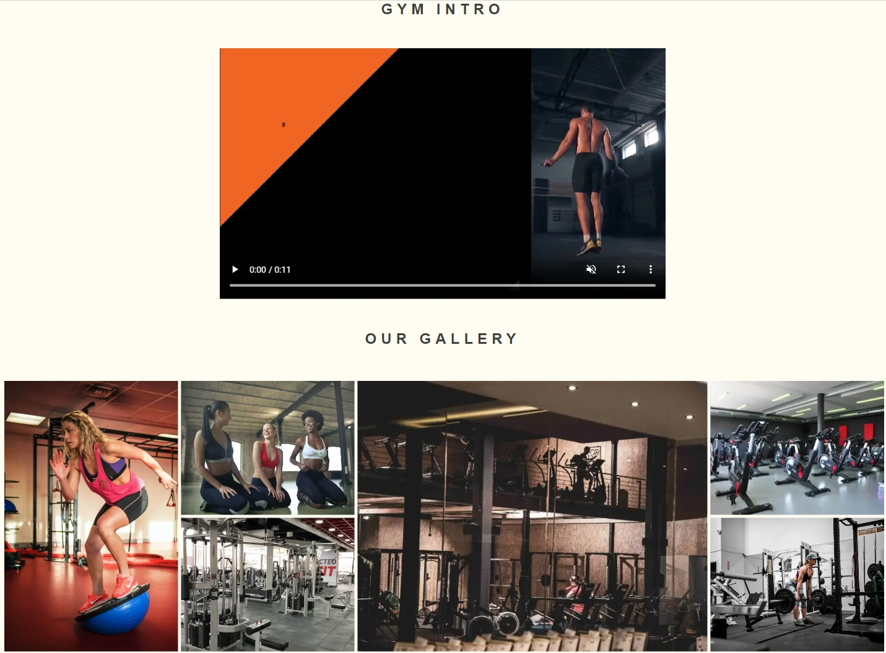
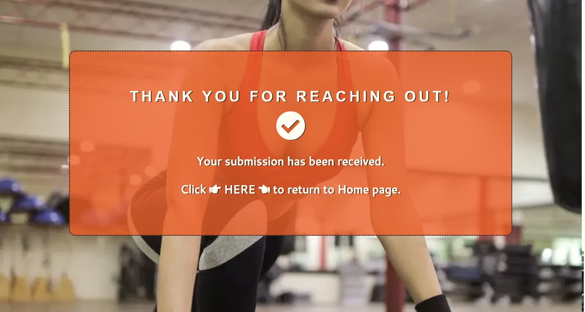

# Fitness Club #

The Fitness Club is a landing page for people interested in physical activity and seeking gym membership with access to additional classes. The Fitness Club, besides gym membership, offers access to coached running, bodyweight, free-weights, boxing, and yoga classes.

Users of this website can find information about the Fitness Club, membership price, and timetable for particular classes. Furthermore, the gallery page allows users to peek into the gym. Lastly, the users can send requests directly to sign up for gym membership on the Join page by filling out the form. Alternatively, the Join page will provide the Fitness Club address and location for the users who wish to visit the club in person. Lastly, users can contact Fitness Club by email by following the link in the Contact Us section.

Click [HERE](https://obione84.github.io/fitness-club/index.html	) to visit live page or follow the linke below:  
<https://obione84.github.io/fitness-club/index.html>

---


## Features ##

### Current Features ###

>- ### *Navigation Bar* ###
>
>   - Featured at the top of the page, for all three pages, and Thank You page. The navigation bar is fully responsive and includes Logo, Home page, Gallery, and Join page. The navigation repeats on each page to provide easy navigation for the users.
>   - The logo and navigation buttons change colour to coral on the hover.
> 
>   - The reversed colour of the button, with a grey shadow, indicates an active page for the user.
>   -	Onclick, the button shifts down and changes the background colour to active, informing users about a successful click before directing the user to the chosen page.
>   - The navigation section will allow users to easily navigate between the pages across various devices without using the back button.  
>
>   
---

> - ### *The Landing Page Image* ###
>
>   - The landing page image section reintroduces the Fitness Club name and encourages users to join the club to stay fit and healthy.
>   - For devices with screens 550px and below, the main photograph changes.  
> 
>   - This section contains photographs of a person training inside the gym, allowing users to take the first look into the gym and clearly understand the website's purpose and target audience. The focus is on people who want to stay fit and healthy and looking for a fitness club.
>
> 
>
---

> - ### *The About Us Section* ###
>
>   - The about us section contains general information about the Fitness Club and includes tables with opening times.
>   - This section introduces the benefits of physical activity to the user and outlines coaching approaches for gym members. Also, this section briefly explains club offers, available equipment and supervised class.
>   - The about us section includes a price offer and calls for action 'Join Now!'.
>   - Also, on hover, the font colour in the price offer box is reversed from black with white to white with black shade. Once clicked, it brings the user to the Join page.
>
> 
>
---

> - ### *The Classes Section* ###
>
>   - This section provides information to the users about the types of classes offered by Fitness Club, the days on which classes take place, starting and finishing times for each class and the name of the coach conducting the class.
> - This section will be updated if any of the information provided changes to ensure users are kept up to date.
>
> 
>
---

> - ### *The Footer* ###
>
>   - The footer section includes links to social media sites for Fitness Club. The links will open in a new tab and encourage the user to connect with the club via social media.
>
> 
>
---

> - ### *The Gallery* ###
>
>   - The user will be able to watch short intro video when visiting the gallery, and review supporting images to see what the gym looks like and understand the environment of offered classes.
>   - This page is valuable to the users as it allows them to view some gym equipment and provides visual cues to class exercises.
>
>
>
---

> - ### *The Join Page* ###
>
>   - This page will allow user to sign up for a gym membership. The user will be asked to provide their full name, date of birth, and email address. All fields are required, and the user must provide all details in order to submit the survey.
>   - Also, this page will allow user to contact store directly in person by providing contact details below the sign up form together with Google Maps location.
>   - Alternatively, this page will allow the user to email Fitness Club directly after clicking the mailbox address in contact details, which will open the user's mailbox.
>
> 
>
---

> - ### *Thank You Page* ###
>
>   - Thank you page will be displayed to the user after successful submission of the sign up form. The user will benefit from this page by receiving direct response confirming the form's submission.
>   - The thank you massage includes the direct link to the home page.
>
> 
>
---

### Future Features ###

> - ### *Online Payment System* ###
>
>   - The online payment feature should be developed and added to the website to allow users to sign up and pay directly through the website. This will improve user experience and the usability of the page.
>
---

## UI/UX ##

> - ### *Color Palette* ###
>
>   - The background color for the website is set to be `#fffcf2`, with the body font colour set as `#403d39`, which provides contrast and makes the text easily readable for the user.
>   - The header and footer are set with `#252422` as a background color and font to `#fffcf2`.
>   - The `#eb5e28` is to highlight action items for the user. The font change color on the hover on all clickable elements, and the price box and sign-up form are set in the color to highlight the action. Once clicked, the price box will bring the user to the join page.
>
> 
---

> - ### *Fonts* ###
>
>   - All fonts used for the website are sans-serif type to provide a clean, minimal and user-friendly design. In addition, the lack of font ornament increases the readability of the content text.
>   - h1 and h2 heading use the "Fjalla One" font, whereas the remaining text is set to use the Cantarell font style.
>   - Font are available from Google Fonts at <https://fonts.google.com/>
>
## Testing ##

> - ### *Validator Testing* ###
>
> | File Name | File Type | Validator Test Result | Validator|
> |-----------|-----------|-----------------------|----------|
> | index| html | pass, no errors or warnings to show | [W3C Validator](https://validator.w3.org/nu/?doc=https%3A%2F%2Fobione84.github.io%2Ffitness-club%2F) |
> |join | html | pass, no errors or warnings to show | [W3C Validator](https://validator.w3.org/nu/?doc=https%3A%2F%2Fobione84.github.io%2Ffitness-club%2Fjoin.html) |
> | gallery | html | pass, no errors or warnings to show | [W3C Validator](https://validator.w3.org/nu/?doc=https%3A%2F%2Fobione84.github.io%2Ffitness-club%2Fgallery.html) |
> | thankyou | html | pass, no errors or warnings to show | [W3C Validator](https://validator.w3.org/nu/?doc=https%3A%2F%2Fobione84.github.io%2Ffitness-club%2Fthankyou.html%3Ffirst_name%3Da%26last_name%3Da%26birthday%3D2023-05-11%26email_address%3Dabc%2540mail.com) |
> | style | css | pass, no error found | [W3C CSS Validator](https://jigsaw.w3.org/css-validator/validator?uri=https%3A%2F%2Fobione84.github.io%2Ffitness-club%2Findex.html&profile=css3svg&usermedium=all&warning=1&vextwarning=&lang=en) |
>
---

> - ### *Accessibility Testing* ###
>
>   - The website passed the accessibility test through the lighthouse function in Chrome developer tools. The fonts and colors are accessible, providing sufficient contrast and making content easily readable.
>   - The website was tested and worked correctly with Chrome, Safari, Edge and Firefox browsers.
>   - The website structure is responsive and was tested on various screen sizes with developer tools, and content and function display correctly down and all standard screen sizes. The navigation is intuitive, and the menu remains readable on various screens.
>
> 
>
---

> - ### *Features Testing* ###
> 
>   - Testing involved manual functionality checks of the website features listed in the table below. In addition, all clickable elements were checked by clicking and recording results. Pass result was granted for all features that match the expected outcome. The test was conducted on various screen sizes and using iPhone 12 Pro and iPad to ensure the expected outcomes repeat on mobile devices.
>
> | Feature | Expected Action| Test Result|
> |---------|----------------|------------|
> | *index.html* | | |
> | Main Logo - Onclick | Load home page, change font color | Pass |
> | Navigation Buttons - Onclick | Load desired page, change button background and font color, move button down, add shadow | Pass |
> | Navigation Button - Hover | Change font color | Pass |
> | Navigation Button - Active | Change background and font color, shift down and add shadow | Pass |
> | Price Box - Hover | Change font color and shadow | Pass |
> | Price Box - Onclick | Load join page | Pass |
> | Footer, Social Media - Onclick | Load desired page in separate tab | Pass |
> | *gallery.html* | | |
> | Video - Control Bar | Play video, unmute, expand to full screen | Pass |
> | *join.html* | | |
> | Form - Required Fields | All fields are required, email must include '@' element, if email entered incorrectly or missing any element, form will not send | Pass |
> | Form - Submit Message | Thank you message displays on successfull submission | Pass |
> | *thankyou.html* | | |
> | Link To Home Page | The link sends user to the home page after click | Pass |
>
---

## Bugs ##

> ### *Solved Bugs* ###
>
> - The W3C Validator highlighted an error where thank you page contained an empty h3 heading. This did not affect the website's performance, but an error was resolved by removing the unnecessary heading.
>
> ```html
> before:
>   <h3><i class="fas fa-check-circle submitted-ok"></i></h3>
> after:
>   <i class="fas fa-check-circle submitted-ok"></i>
> ```
>
> - Also, W3CcValidator indicated unsupported element used in the code
>
> ```html
> before:
>   <h3>Du&#769n Laoghaire</h3>
> after:
>   <h3>Dun Laoghaire</h3>
> ```
>
> - The size of the join page was not responsive, therefore the css file had to be altered, and form, padding and marigns resized.
> - The navigation button was wrapped in 'a' element. This not affected funtionality of the website, but was highlighted by W3C Validator.
>
> ```html
> before:
>   <a href="join.html"><button type="button">Join</button></a>
> after:
>   <button onclick="window.location.href='join.html';">Join</button>
> ```
>
> - The fontawesome script was moved from under the body, to the head elemenet of the page.
>
---

> ### *Unfixed Bugs* ###
>
> - None.
>
---

## Deployment ##